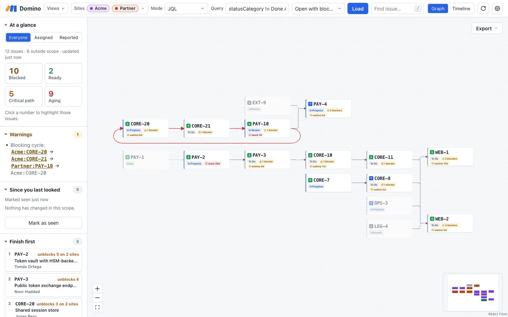
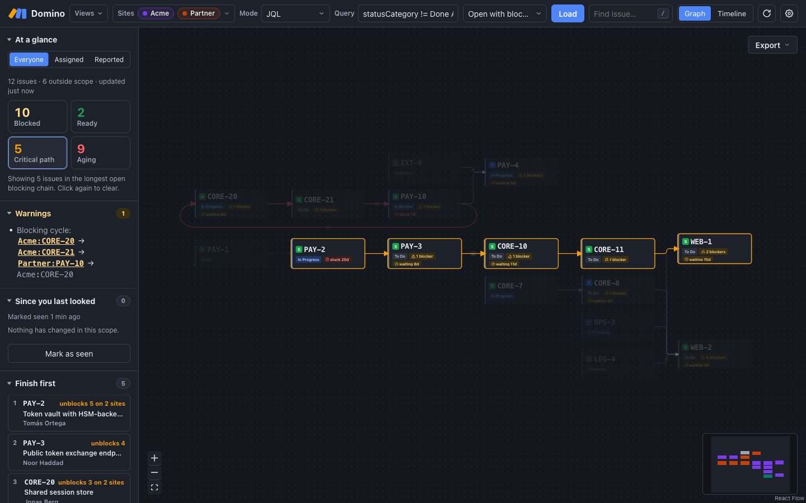
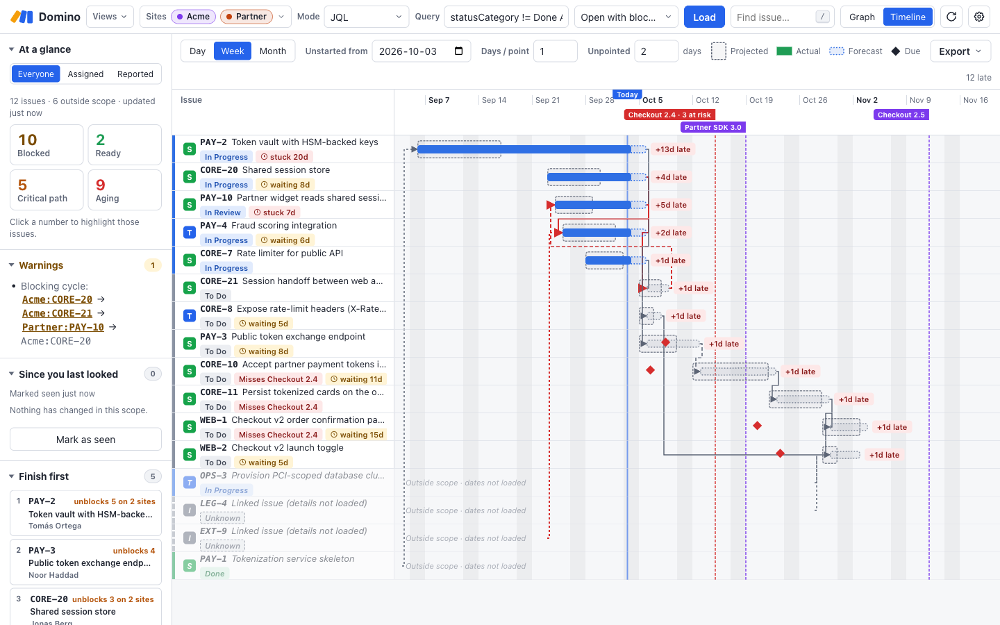
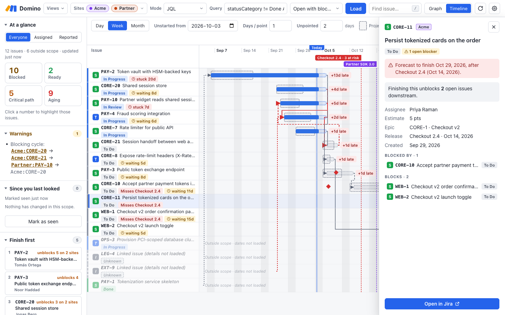
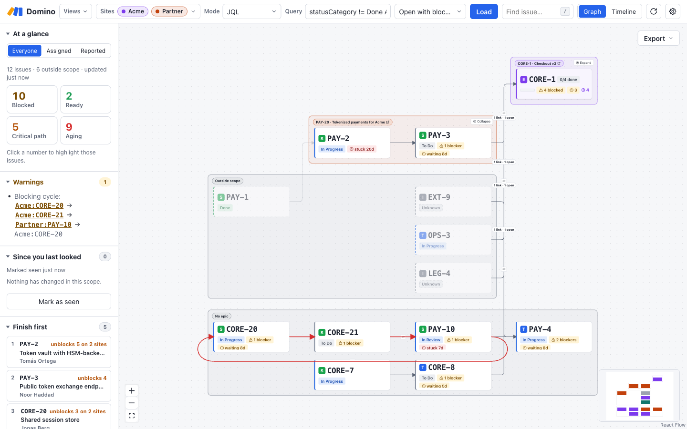

# Domino

Domino draws your Jira tickets as a flowchart, so you can see how they're connected to each other. Jira tracks the links between tickets, but I didn't see any tools that showed them the way I liked.

I used to work with my teams to build these flows out by hand, but the increasing demands of modern software development have cut down on my ability to invest in building an understanding of the systems and creating these diagrams to work from. They're still immensely useful, so I needed a way to make them easier to create and navigate. Now, instead of it being something that takes me an afternoon of working with a team, it's something I can do in seconds.



## Running it

You'll need Node 20+ and Rust (`rustup`), plus [Tauri's system packages](https://v2.tauri.app/start/prerequisites/) on Linux.

```sh
npm install
npm run dev          # desktop app, mock data
npm run dev:web      # browser preview, mock data (http://localhost:1420)
npm run tauri build  # installer for your platform
```

Installers are on the [Releases](https://github.com/stevethedev/domino/releases) page, and installed copies keep themselves up to date.

## Connecting to Jira

In Settings (&#9881;):

1. Set **Data source** to **Live Jira**.
2. **Add site** with its base URL (like `https://acme.atlassian.net`), then sign in with either:
   - **API token:** your email and an [Atlassian API token](https://id.atlassian.com/manage-profile/security/api-tokens);
   - **OAuth:** an OAuth 2.0 (3LO) app's client ID and secret, then **Connect with Atlassian**. One sign-in covers all your sites.
3. **Test** each site.

For the OAuth app, create an OAuth 2.0 integration at [developer.atlassian.com/console/myapps](https://developer.atlassian.com/console/myapps/) with the Jira scopes `read:jira-work`, `read:jira-user` and `offline_access`, and the callback `http://127.0.0.1:53682/callback`.

Domino only reads from Jira; it never changes anything there. The credentials you enter go straight to the OS keychain; they never end up in the config file, and the UI never reads them back. An environment variable named after the secret (like `DOMINO_ACME_TOKEN`) overrides the keychain, which is handy in development.

Each site can **Always filter by** some JQL (like `project in (CORE, WEB)`), ANDed onto every search on it.

Settings writes `domino.config.json` in the OS app-config folder (`~/Library/Application Support/org.change.domino/` on macOS). You can edit it by hand while the app's closed. If it can't be read, Domino starts without sites, leaves the file alone and says what's wrong; fix it and choose **Reload file**, set your sites up again in Settings, or **Start fresh** (the old file is kept beside it as `domino.config.broken.json`, or `-2`, `-3`… if earlier ones are there; Domino says which).

To show tickets right away, Domino keeps the last ones loaded for your 12 most recent scopes, for up to 30 days, in `ticket-cache/` in the OS app-data folder. Each file is encrypted with a key kept in the OS keychain (`DOMINO_CACHE_KEY`). Changing or removing a site, its token or the Atlassian sign-in discards that site's cached tickets, and an app update discards them all. **Settings → Cached tickets** clears the cache and replaces the key.

## Using it

**Loading.** Pick sites and a mode in the top bar: JQL (with presets), an epic, or **Seed + depth** (a ticket plus everything within N links). Each site runs `(site filter) AND (query)`. Loads stop at 300 tickets.

While a load runs, the last tickets for that scope stay on screen (from this session, or from the cache) under an **Updating…** note, with each site's progress. Switching to a new scope fades the old tickets until the new ones arrive. If a site fails, its last tickets stay, and the sidebar says how old they are.

**The graph.** This is the part I care about most; I want to follow a chain of work from one ticket to the next without opening each one.

- Arrows are ticket links; blockers sit left of what they block.
- &#8644; marks links between sites.
- Faded cards are linked tickets outside what you loaded.
- Blocking cycles are red and listed under **Warnings**.
- Group by site, epic or assignee for swimlanes.
- Below 60% zoom, cards shrink to a readable short form.

**The sidebar.** When I'm planning, I want to know what's stuck and which tickets would free up the most work if they got done, so that's what the sidebar shows.

- **At a glance:** blocked, ready, critical-path and aging counts, for everyone or just you. Click one to highlight those tickets.
- **Finish first:** the open tickets that unblock the most work.
- **Since you last looked:** what's changed since you marked the scope seen.
- **Releases:** upcoming fix versions, and which tickets are forecast to miss them.



**The timeline.** The flowchart shows how things connect, but not when they'll land, so the timeline shows the same tickets over time: the estimate (dashed), actual work (solid) and forecast (dotted), plus due dates (&#9670;) and releases. A late blocker pushes back everything it blocks. Estimates are story points &times; **Days / point**, with a default for unpointed tickets, and each bar says how its forecast compares ("+3d over estimate"). It opens on today (**Today** scrolls back), and with the timeline open the sidebar's **Legend** explains every mark.



**Details.** Click a card or row for its status, people, dates, release, description, links and status history. The description is fetched when you open the ticket; for images and attachments, open it in Jira. &#8984;/Ctrl+click opens it in Jira.



**Folding epics.** On bigger projects the full graph gets busy, so I fold up the epics I'm not looking at. Grouped by epic, you can collapse a lane into one summary card with its links combined, in either view.



**Filtering.** **Display** hides tickets by status, type, assignee or priority without reloading, picks which links to draw, and can **Hide implied links** (A&rarr;C when A&rarr;B&rarr;C is drawn).

**Sorting.** **Display &rarr; Sort by** orders tickets by priority, status, key, assignee, story points, due date, forecast finish, how much they unblock, how many blockers they have, or release. In the graph, each column follows the sort (columns themselves still follow the blocking links); in the timeline, rows do. Lanes follow their first ticket. A chip says what the view is sorted by, and its &#x2715; goes back to the natural order (dependencies in the graph, start date in the timeline).

**Sharing:**

- **Views** saves what you're looking at, and exports or imports views as a file.
- **Export** copies the graph or timeline as an image, or saves a PNG or SVG.
- Settings can refresh in the background and tell you when your work's unblocked.

**Keys.** I wanted to be able to walk a chain from the keyboard the same way I'd trace it with my finger on a diagram.

| Key                                      | Does                                                           |
| ---------------------------------------- | -------------------------------------------------------------- |
| `/` or &#8984;K                          | Find a ticket                                                  |
| `g` / `t`                                | Graph / Timeline                                               |
| Tab, Enter, Esc                          | Into the view, open details, close them (or clear a highlight) |
| &larr; / &rarr;                          | Follow blocking links back / forward                           |
| &uarr; / &darr;                          | Other tickets at that step, then the next in the column        |
| &#8984;/Ctrl+Enter or &#8984;/Ctrl+click | Open in Jira                                                   |

The cards &larr; and &rarr; would go to are outlined first.

## More

- [docs/development.md](docs/development.md): checks, code layout, styling, releases and update signing.
- [CHANGELOG.md](CHANGELOG.md): what changed in each release.
